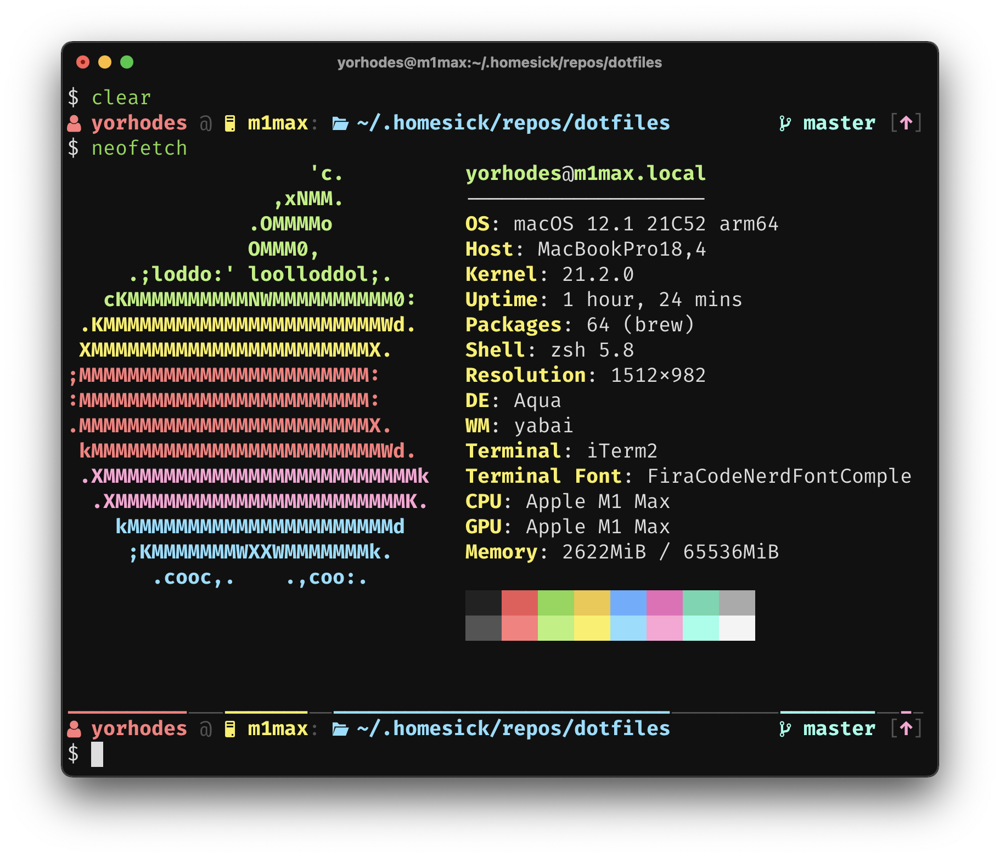

# dotfiles

config my life

## software

[homesick](https://github.com/technicalpickles/homesick) for dotfile management

[skhd](https://github.com/koekeishiya/skhd) as a hotkey daemon

[simple-bar](https://github.com/Jean-Tinland/simple-bar) as an [Übersicht](https://github.com/felixhageloh/uebersicht) status bar

[Aerial](https://github.com/JohnCoates/Aerial) as a screensaver

## hardware

viewing 2 monitors

[LG HDR WQHD Display horizontal 3440 x 1440](https://www.amazon.com/LG-34WN80C-B-inch-Connectivity-Compatibility/dp/B07YGZ7C1K/ref=sxts_sxwds-bia-wc-nc-drs1_0)

[HP VH240a Display vertical 1080 x 1920](https://www.amazon.com/HP-23-8-inch-Adjustment-Speakers-VH240a/dp/B072M34RQC)

typing on a [Vortex Race 3](https://mechanicalkeyboards.com/shop/index.php?l=product_detail&p=3917)

clicking on an [Anker wireless vertical ergonomic mouse](https://www.amazon.com/Anker-Wireless-Vertical-Ergonomic-Optical/dp/B00BIFNTMC/ref=sr_1_3)

sitting on an [ƛutonomous ErgoChair 2](https://www.autonomous.ai/office-chairs/ergonomic-chair?option20=54) in front of an [ƛutonomous SmartDesk 2](https://www.autonomous.ai/standing-desks/smartdesk-2-home?option1=1&option2=7&option16=36&option17=1881)

doomscrolling on a [OnePlus 8T](https://www.oneplus.com/8t)

tapping on a [iPad Air](https://www.apple.com/shop/buy-ipad/ipad-air)
